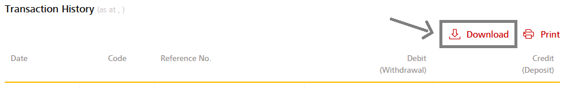
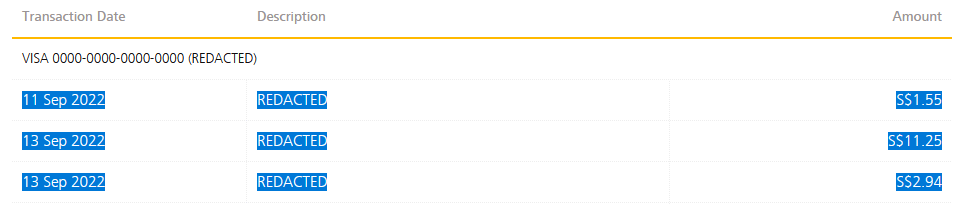

# bankparse

This program parses bank transactions from the crappy formats they provide into
a standardized form that can be imported into your budgeting software of
choice.

Singapore banks don't provide well structured transaction data. It's usually in
the form of csv files formatted with varying levels of quality. In some cases a
csv file isn't even provided (DBS credit card statements). This program intends
to provide a workaround for the banks' shortcomings.

Currently supported formats:

1. DBS transaction history for debit accounts exported as a .csv file.
2. DBS credit card transactions manually copied to clipboard from the webpage.

## Installation

```
go install github.com/benjaminheng/bankparse@latest
```

## Usage

### Parsing DBS CSV files

Download the CSV file from DBS's website:



Run the following command:

```bash
$ bankparse parse dbs-csv <file>
```

### Parsing DBS credit card transactions

Copy the credit card transactions from DBS's website:



Save the transactions to a file.

Run the following command:

```bash
$ bankparse parse dbs-credit-card-transactions <file>
```
